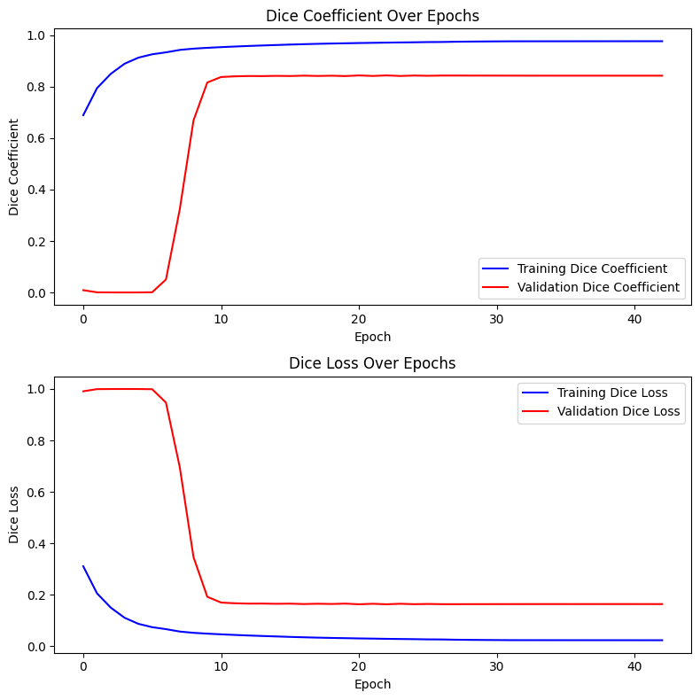
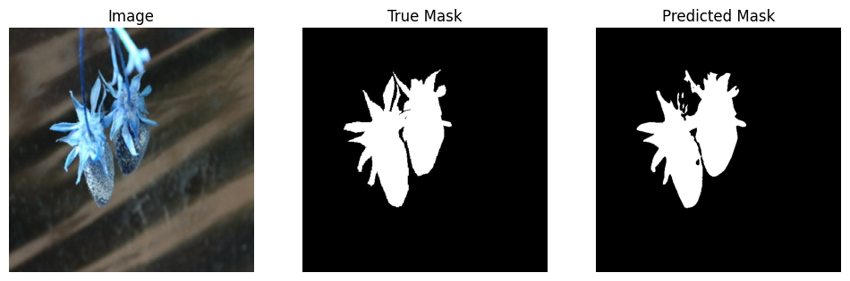
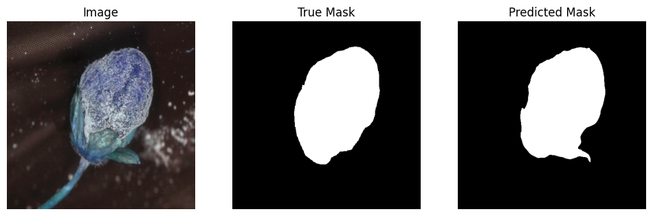

# Strawberry Mold Segmentation with UNet Variants

This project includes various neural network models for image segmentation, particularly for strawberry mold detection. The models include:
- **UNet**: The original UNet model.
- **Residual UNet**: A modified version of UNet with residual connections.
- **StrawberryMoldSegNet**: A customized UNet3+ model for segmentation.

## Models
- `unet_model.py`: The UNet implementation.
- `residual_unet.py`: The Residual UNet implementation.
- `strawberry_mold_segnet.py`: The custom UNet3+ variant.

## Preprocessing & Metrics
- `preprocessing.py`: Data loading and preprocessing script.
- `metrics.py`: Contains the dice loss and coefficient functions.

## Training and Results
- `model_training.py`: Training script including model saving and callback functions.
- `check_metrics.py`: Script to check validation and test dice coefficient along with additional metrics (F1, Jaccard, etc.).
- `plot_metrics.py`: To plot validation and training dice loss and coefficient curves.
- `visualize_results.py`: For visualizing prediction results.

## Images

## How to Use
To run the models, simply execute the respective scripts. All the models have been tested on a custom dataset of strawberry mold.

## License
This project is licensed under the MIT License.
